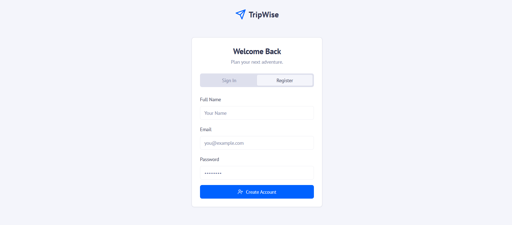
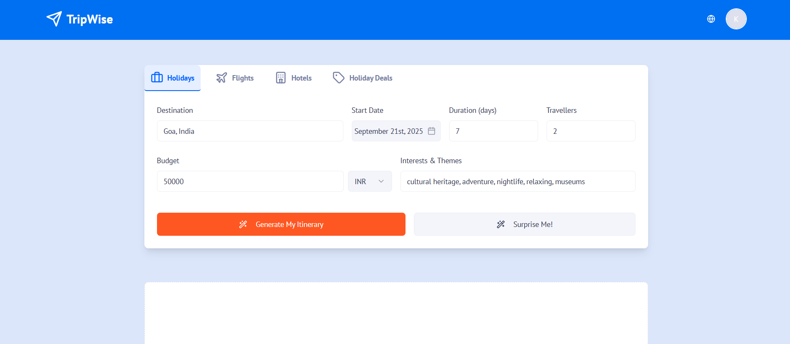
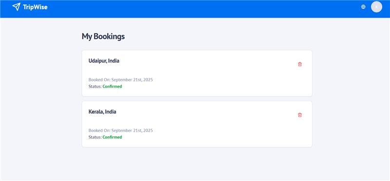

## Hackathon
This project was built during Gen AI Exchange Hackathon - 2025.  
Team: Wildcard Engine
Team Members: Kruthik Ballari, Sai Tharun Kollampally, Sahithi Chandra K

## Problem We Solved
Planning trips can be overwhelming, requiring multiple tools and sources. Travelers often struggle with managing itineraries, finding attractions, and syncing schedules.  

## Our Solution
TripWise is an AI-powered travel assistant that helps users:
- Generate itineraries tailored to their interests  
- Store trip details in one place  
- Collaborate with travel companions  

## Demo
- Live Demo: https://9000-firebase-studio-1758298670230.cluster-y3k7ko3fang56qzieg3trwgyfg.cloudworkstations.dev  
- Demo Video: https://drive.google.com/file/d/1X9MYqlzL7_JtJwUMGrTr3geMk0E76Msz/view?usp=sharing 

## Screenshots
  
  




## Quickstart
1. Clone repo: `git clone ...`
2. Install deps: `npm install`
3. Run dev: `npm run dev`
4. Visit: `http://localhost:3000`

## Future Improvements
- Integrate Chatbot support APIs for query resolutions
- Integrate Booking APIs  
- Add group collaboration features  
- AI-powered budget optimization  

---

# TripWise

*Your AI-powered travel companion*

TripWise is a cutting-edge, full-stack web application that redefines the travel planning experience. Leveraging the power of Google AI and Firebase, it dynamically generates personalized, end-to-end itineraries tailored to a traveler's unique budget, interests, and real-time conditions. This solution aims to eliminate the hassle of traditional trip planning by offering a seamless, one-click booking experience through a partner's inventory.

A Next.js + TypeScript web app built using Firebase and related technologies. Plan trips, generate itineraries, and manage travel information with ease.

---

## Table of Contents

- [Features](#features)  
- [Tech Stack](#tech-stack)  
- [Getting Started](#getting-started)  
- [Project Structure](#project-structure)  
- [Deployment](#deployment)  
- [Configuration](#configuration)  
 

---

## Features

Here are some of the core things TripWise aims to support (or already supports):

- Travel planning dashboard / UI  
- Store & retrieve trip data (destinations, dates, etc.)  
- Itinerary generation and scheduling  
- Integration with Firebase (authentication, hosting, database)  
- Responsive UI built with Tailwind CSS  
- Fast builds & type safety via TypeScript  

---

## Tech Stack

- **Frontend / Framework**: Next.js (React, TypeScript)  
- **Styling**: Tailwind CSS  
- **Hosting / Backend / Database**: Firebase  
- **Configuration / Build Tools**:  
  - package.json / npm  
  - Tailwind config  
  - PostCSS  
  - TypeScript configuration  
  - Next.js config (e.g. `next.config.ts`)  

---

## Getting Started

To run TripWise locally for development:

1. **Clone the repo**  
   ```bash
   git clone https://github.com/stkollamp/TripWise.git
   cd TripWise
   ```

2. **Install dependencies**  
   ```bash
   npm install
   ```

3. **Set up Firebase configuration**  
   - You’ll need a Firebase project.  
   - Set up services (Auth, Firestore / Realtime DB, Hosting) as needed.  
   - Fill in necessary configuration / credentials (API keys, etc.) in environment variables.

4. **Configure environment variables**  
   - Copy `.env.example` (if present) to `.env.local`.  
   - Populate with your Firebase credentials and any other keys.

5. **Run locally**  
   ```bash
   npm run dev
   ```
   You should be able to open `http://localhost:3000` in your browser to see TripWise in action.

---

## Project Structure

Here is a rough layout of the project’s folders / files:

```
TripWise/
├── src/                    # Source code (pages, components, etc.)
├── docs/                   # Documentation, design decisions, etc.
├── .firebaserc             # Firebase project settings
├── next.config.ts          # Next.js configuration
├── tailwind.config.ts      # Tailwind CSS configuration
├── tsconfig.json           # TypeScript configuration
├── package.json            # Dependencies & scripts
├── postcss.config.mjs      # PostCSS setup
└── apphosting.yaml         # Firebase hosting configuration
```

- **src/**: contains UI components, pages/routes, utilities.  
- **docs/**: optional, for documentation or design specs.  
- Config files for build, linting, styling, etc.

---

## Deployment

TripWise is set up to deploy via Firebase Hosting. Basic flow:

1. Build the production version:

   ```bash
   npm run build
   ```

2. Deploy to Firebase:

   ```bash
   firebase deploy
   ```

Make sure Firebase project is set properly, hosting is configured, and you’ve set correct public directory etc., in the `apphosting.yaml` or firebase config.

---

## Configuration & Environment Variables

You’ll likely need values for:

- Firebase project credentials (apiKey, authDomain, etc.)  
- Firebase database / Firestore settings  
- Any external services / APIs (if used for itinerary suggestions, maps, etc.)  
- Environment mode (development / production)

Ensure to **never** commit secret keys. Use `.gitignore` to ignore `.env.*` files.


